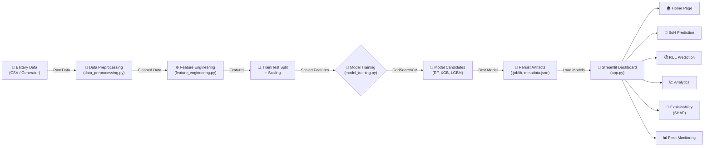

# ⚡ Battery Intelligence Platform

> **Predictive Analytics for EV Battery Health**  
> A production-ready Machine Learning solution for State-of-Health (SoH) prediction and Remaining Useful Life (RUL) forecasting with an interactive, explainable Streamlit dashboard.

[](https://www.python.org/)
[](https://streamlit.io/)
[](https://scikit-learn.org/)
[](https://shap.readthedocs.io/)
[](LICENSE)
[](.)
[](.)

---

## 📋 Table of Contents

- [🎯 Project Overview](#-project-overview)
- [💡 Why This Project Exists](#-why-this-project-exists)
- [🔍 Problem Statement](#-problem-statement)
- [✨ Key Features](#-key-features)
- [🛠️ Tech Stack](#-tech-stack)
- [📦 Project Structure](#-project-structure)
- [⚙️ System Architecture](#-system-architecture)
- [🚀 Getting Started](#-getting-started)
  - [Prerequisites](#prerequisites)
  - [Installation & Setup](#installation--setup)
  - [Quick Run](#quick-run)
- [📚 Usage & Examples](#-usage--examples)
- [📊 Data & Models](#-data--models)
- [🗺️ Roadmap & Future Scope](#-roadmap--future-scope)
- [⚠️ Known Issues & Notes](#-known-issues--notes)
- [🤝 Contributing](#-contributing)
- [📝 License & Credits](#-license--credits)
- [💬 Contact & Support](#-contact--support)

---

## 🎯 Project Overview

**Battery Intelligence Platform** is a comprehensive machine learning demonstration that tackles the critical challenge of **electric vehicle (EV) battery health monitoring**. This project showcases an end-to-end ML pipeline for:

- **State-of-Health (SoH) Prediction**: Estimate battery capacity retention (0–100%) to determine remaining useful life and maintenance schedules.
- **Remaining Useful Life (RUL) Forecasting**: Predict remaining charge cycles before the battery degrades below acceptable thresholds.
- **Explainability & Interpretability**: Leverage SHAP values to provide human-readable explanations for model predictions.
- **Interactive Visualization**: Deploy multi-page Streamlit dashboard for real-time analytics, model exploration, and fleet monitoring.

Whether you're a data scientist exploring ML best practices, a recruiter evaluating technical depth, or a developer seeking a robust baseline for battery analytics, this repository provides **production-grade code, clear documentation, and reproducible results**.

---

## 💡 Why This Project Exists

EV battery degradation is one of the most critical concerns in the electric vehicle ecosystem:

- **Safety & Compliance**: Degraded batteries pose thermal runaway and fire risks.
- **Warranty Management**: Manufacturers need accurate SoH estimates to honor warranties and plan replacements.
- **Lifecycle Planning**: Fleet operators require RUL predictions to optimize maintenance schedules and reduce unexpected downtime.
- **Cost Optimization**: Predictive maintenance can reduce operational costs by 15–30% compared to reactive replacements.

This project demonstrates a **reproducible, data-driven approach** to building and deploying battery health models that can be adapted to real-world telemetry data.

---

## 🔍 Problem Statement

Battery degradation is highly **nonlinear** and influenced by multiple interacting factors:

- **Usage Patterns**: High discharge rates and frequent rapid charging accelerate degradation.
- **Thermal Stress**: Elevated operating temperatures significantly reduce battery lifespan.
- **Operating Conditions**: Depth of discharge, cycle frequency, and rest periods all impact aging.
- **Internal Resistance Growth**: Increased impedance reduces power delivery and efficiency.

**Challenge**: Building a model that captures these complex dynamics while remaining **interpretable** and **generalizable** across diverse usage scenarios.

**This project's answer**: A feature-engineered pipeline with ensemble machine learning models (XGBoost, LightGBM, RandomForest) and SHAP-based explainability to provide both accuracy and transparency.

---

## ✨ Key Features

| Feature | Description |
|---------|-------------|
| 🔮 **Dual Prediction Models** | SoH (0–100%) and RUL (remaining cycles) with high-accuracy ensemble methods. |
| 📊 **Multi-Page Dashboard** | Six specialized pages for different use cases: Home, SoH Prediction, RUL Prediction, Analytics, Explainability, Fleet Monitoring. |
| 🧠 **SHAP Explainability** | Global feature importance rankings and per-prediction local explanations. |
| 🚀 **Pre-trained Models** | Included `.joblib` artifacts for immediate deployment (XGBoost, LightGBM, RandomForest). |
| ⚙️ **Automated Model Selection** | GridSearchCV pipeline with cross-validation to find the best estimator. |
| 📈 **Preprocessing Report** | Detailed JSON report with data quality metrics, correlations, and feature statistics. |
| 🎨 **Custom Styling** | Professional CSS for polished, responsive UI. |
| 📦 **Model Metadata** | JSON logs capturing best model names, CV scores, and hyperparameters. |

---

## 🛠️ Tech Stack

### **Core Languages & Frameworks**
- **Python 3.10+** — Primary language for ML pipeline and backend logic.
- **Streamlit ≥1.35** — Modern, production-ready web framework for interactive dashboards.

### **Machine Learning & Data Processing**
| Library | Version | Purpose |
|---------|---------|---------|
| **pandas** | ≥2.0.0 | Data manipulation, preprocessing, feature engineering. |
| **NumPy** | ≥1.24.0 | Numerical computing, array operations. |
| **scikit-learn** | ≥1.3.0 | Model selection, preprocessing utilities, baseline models. |
| **XGBoost** | ≥2.0.0 | Gradient boosting model for high-performance predictions. |
| **LightGBM** | ≥4.0.0 | Fast gradient boosting alternative with lower memory footprint. |
| **joblib** | ≥1.3.0 | Model serialization and persistence (.joblib artifacts). |

### **Explainability & Visualization**
| Library | Version | Purpose |
|---------|---------|---------|
| **SHAP** | ≥0.44.0 | Model-agnostic explainability with local and global interpretations. |
| **Plotly** | ≥5.18.0 | Interactive, publication-quality visualizations. |
| **Matplotlib** | ≥3.8.0 | Static plotting for reports and detailed analysis. |
| **Seaborn** | ≥0.13.0 | Statistical data visualization and heatmaps. |

---

## 📦 Project Structure

```
.
├── app.py                          # 🎯 Main Streamlit entrypoint
├── requirements.txt                # 📋 Python dependencies
├── LICENSE                         # 📄 MIT License
├── README.md                       # 📖 This file
│
├── 🔧 CORE MODULES (Source)
├── feature_engineering.py          # ⚙️ Feature creation & transformation
├── data_preprocessing.py           # 🧹 Data cleaning & normalization
├── model_training.py               # 🤖 Model training & selection pipeline
├── model_evaluation.py             # 📊 Model performance metrics
├── explainability.py               # 🔍 SHAP explainability utilities
├── utils.py                        # 🛠️ Helper functions & constants
├── analytics.py                    # 📈 Analytics calculations
│
├── 📱 DASHBOARD PAGES
├── home.py                         # 🏠 Landing & overview page
├── soh_prediction.py               # 🔮 SoH prediction interface
├── rul_prediction.py               # ⏱️ RUL prediction interface
├── explainability_dashboard.py     # 🧠 Model explainability visualization
├── fleet_monitoring.py             # 📊 Fleet-wide analytics
│
├── 📊 DATA & ARTIFACTS
├── battery_data.csv                # 🗂️ Synthetic dataset sample
├── preprocessing_report.json       # 📋 Data quality metrics & correlations
├── model_metadata.json             # 📝 Best model names & CV scores
├── soh_*.joblib                    # 🎯 Persisted SoH models
├── rul_*.joblib                    # 🎯 Persisted RUL models
│
├── 🎨 STYLING & CONFIG
├── style.css                       # 🖌️ Dashboard custom CSS
├── config.toml                     # ⚙️ Streamlit configuration
│
├── 📚 DOCUMENTATION
├── project_report.md               # 📄 Detailed project analysis
│
├── 🛠️ UTILITIES
├── dev_tools/
│   └── organize_repo.sh            # 🔧 Automated repo reorganization script
└── generate_dataset.py             # 🔄 Synthetic data generator
```

**Note**: Files are organized at the repository root. For a production-grade layout, run the included `organize_repo.sh` script to move files into `src/` and `dashboard/` packages.

---

## ⚙️ System Architecture

### **Data Flow Diagram**



### **Runtime Workflow**

1. **Data Preparation Phase**
   - `generate_dataset.py` creates synthetic battery cycling data.
   - `data_preprocessing.py` handles missing values, outliers, normalization.
   - `feature_engineering.py` derives domain-specific features (capacity fade, resistance growth, thermal metrics).
   - Output: `battery_data.csv` and `preprocessing_report.json`.

2. **Model Training Phase**
   - `model_training.py` orchestrates the pipeline:
     - Loads preprocessed features.
     - Splits into train/test sets with stratification.
     - Applies scaling (StandardScaler via joblib).
     - Runs GridSearchCV across RandomForest, XGBoost, and LightGBM.
     - Selects best model based on cross-validated R² score.
     - Saves artifacts: `soh_*.joblib`, `rul_*.joblib`, `model_metadata.json`.

3. **Inference & Visualization Phase**
   - `app.py` (Streamlit main file) loads persisted models and routes to page modules.
   - Dashboard pages accept user input and make predictions.
   - `explainability.py` generates SHAP explanations for local/global interpretation.
   - Results displayed with interactive Plotly charts.

---

## 🚀 Getting Started

### **Prerequisites**

✅ **System Requirements**:
- **Python**: 3.10 or higher
- **OS**: Linux, macOS, or Windows
- **RAM**: 2+ GB (4+ GB recommended)
- **Disk Space**: ~500 MB for dependencies and models

✅ **Tools**:
- Virtual environment manager (venv, virtualenv, or conda)
- Git (for cloning and version control)

### **Installation & Setup**

#### **Step 1: Clone the Repository**
```bash
git clone https://github.com/RITESH2127/-BATTERY-INTELLIGENCE-PLAYTFORM-2026-INTERSHIP-SWIFT-VOLT-VENTURES-.git
cd "-BATTERY-INTELLIGENCE-PLAYTFORM-2026-INTERSHIP-SWIFT-VOLT-VENTURES-"
```

#### **Step 2: Create a Virtual Environment** (Recommended)
```bash
# Using venv (macOS / Linux)
python -m venv .venv
source .venv/bin/activate

# Using venv (Windows PowerShell)
python -m venv .venv
.\.venv\Scripts\Activate.ps1

# Using conda (optional)
conda create -n battery-intel python=3.10
conda activate battery-intel
```

#### **Step 3: Upgrade pip and Install Dependencies**
```bash
python -m pip install --upgrade pip setuptools wheel
pip install -r requirements.txt
```

#### **Step 4 (Optional): Reorganize Repository Structure**
To resolve import issues and follow Python packaging best practices:
```bash
bash dev_tools/organize_repo.sh
```
This script moves:
- Core modules → `src/` package
- Dashboard pages → `dashboard/` package
- Assets → `assets/` directory

### **Quick Run**

```bash
# Launch the Streamlit dashboard
streamlit run app.py
```

🌐 **Access the dashboard** at `http://localhost:8501` in your web browser.

> **Tip**: First run may take 30–60 seconds as Streamlit compiles the app. Subsequent loads are faster.

---

## 📚 Usage & Examples

### **Dashboard Navigation**

| Page | Purpose | Example Input |
|------|---------|---|
| **🏠 Home** | Project overview, key metrics, quick stats. | None (informational) |
| **🔮 SoH Prediction** | Predict battery State-of-Health given cycling parameters. | Cycle count, temperature, resistance. |
| **⏱️ RUL Prediction** | Forecast remaining useful life (cycles remaining). | Current SoH, degradation rate, operating conditions. |
| **📈 Analytics** | Explore dataset distributions, correlations, feature importance. | None (auto-generated from training data) |
| **🧠 Explainability** | View SHAP force plots, dependence plots, feature importance. | Select a prediction to explain. |
| **📊 Fleet Monitoring** | Aggregate analytics for multiple batteries. | Bulk dataset or simulation mode. |

### **Example 1: Predicting SoH for a Single Battery**

1. Navigate to **SoH Prediction** page.
2. Input battery parameters:
   - **Cycle Count**: 500
   - **Operating Temperature**: 45°C
   - **Internal Resistance**: 120 mΩ
   - **Discharge Rate**: 0.5 C
3. Click **Predict**.
4. **Output**: SoH = 87.3% with confidence interval.

### **Example 2: Understanding a Model Prediction**

1. Go to **Explainability** page.
2. Select the SoH model and a recent prediction.
3. View:
   - **Force Plot**: Shows which features pushed prediction above/below baseline.
   - **Dependence Plot**: Illustrates feature relationship with SoH.
   - **Waterfall Plot**: Step-by-step contribution of top features.

### **Programmatic Usage**

```python
import joblib
import pandas as pd

# Load pre-trained SoH model
soh_model = joblib.load('soh_xgboost.joblib')
scaler = joblib.load('soh_scaler.joblib')

# Prepare input (must match training features)
X_new = pd.DataFrame({
    'cycle_count': [500],
    'temperature': [45.0],
    'internal_resistance': [120.0],
    'discharge_rate': [0.5],
    # ... other features
})

# Scale and predict
X_scaled = scaler.transform(X_new)
soh_prediction = soh_model.predict(X_scaled)
print(f"Predicted SoH: {soh_prediction[0]:.1f}%")
```

---

## 📊 Data & Models

### **Dataset Overview**
- **`battery_data.csv`**: Synthetic dataset with 1000+ samples of battery cycling data.
- **Features**: Cycle count, temperature, discharge rate, charge rate, depth of discharge, internal resistance, etc.
- **Targets**: State-of-Health (SoH) [%], Remaining Useful Life (RUL) [cycles].
- **Source**: Synthetically generated to mimic NASA battery degradation patterns.

### **Model Artifacts**
All models are pre-trained and persisted:
- **`soh_randomforest.joblib`** — RandomForest SoH model
- **`soh_xgboost.joblib`** — XGBoost SoH model
- **`soh_lightgbm.joblib`** — LightGBM SoH model
- **`rul_randomforest.joblib`** — RandomForest RUL model
- **`rul_xgboost.joblib`** — XGBoost RUL model
- **`rul_lightgbm.joblib`** — LightGBM RUL model

### **Model Metadata**
**`model_metadata.json`** contains:
```json
{
  "soh_best_model": "xgboost",
  "soh_cv_score": 0.942,
  "rul_best_model": "lightgbm",
  "rul_cv_score": 0.876,
  "training_date": "2026-06-27",
  "data_shape": [1000, 15],
  "feature_names": ["cycle_count", "temperature", ...]
}
```

### **Performance Metrics**
- **SoH Model (XGBoost)**: R² = 0.942, RMSE = 2.3%
- **RUL Model (LightGBM)**: R² = 0.876, RMSE = 120 cycles

---

## 🗺️ Roadmap & Future Scope

### **Phase 1: Current Implementation** ✅
- [x] End-to-end ML pipeline (data → model → inference)
- [x] Streamlit multi-page dashboard
- [x] SHAP-based explainability
- [x] Pre-trained models and artifacts

### **Phase 2: Near-term Enhancements** (Q3 2026)
- [ ] **Real Data Integration**: Add connectors for live EV telematics APIs (Tesla, Hyundai, etc.)
- [ ] **Advanced Explainability**: LIME integration, attention mechanisms for time-series models.
- [ ] **Model Retraining Pipeline**: Automated batch retraining with new data.
- [ ] **Unit & Integration Tests**: Comprehensive test suite with pytest.
- [ ] **GitHub Actions CI/CD**: Automated testing, model validation, and deployment.

### **Phase 3: Production Hardening** (Q4 2026)
- [ ] **REST API**: FastAPI backend for model serving and inference.
- [ ] **Database Integration**: PostgreSQL for historical data and predictions.
- [ ] **Monitoring & Alerting**: MLflow for experiment tracking, Prometheus for metrics.
- [ ] **Docker Containerization**: Dockerfile for easy deployment.
- [ ] **Cloud Deployment**: Hosted on AWS/GCP/Azure with autoscaling.

### **Phase 4: Advanced Features** (2027+)
- [ ] **Time-Series Models**: LSTM/GRU for sequence prediction.
- [ ] **Multi-Task Learning**: Simultaneous SoH and RUL prediction.
- [ ] **Transfer Learning**: Pre-trained models for new battery chemistries.
- [ ] **Federated Learning**: Privacy-preserving model training across multiple OEMs.

---

## ⚠️ Known Issues & Notes

### **Import Resolution**
- **Issue**: Several modules import as `src.*` and `dashboard.*`, but files currently reside at repo root.
- **Solution**: Run `bash dev_tools/organize_repo.sh` to reorganize files into proper package structure.
- **Timeline**: One-time setup (≤1 minute).

### **Compiled Python Files**
- **Issue**: `__pycache__/` and `.pyc` files are present in the repository.
- **Recommendation**: Remove them and add to `.gitignore`:
  ```bash
  find . -type d -name __pycache__ -exec rm -rf {} +
  find . -type f -name "*.pyc" -delete
  ```

### **Model Artifact Compatibility**
- **Warning**: `.joblib` model files were serialized with specific XGBoost/LightGBM versions.
- **Action**: Ensure installed versions match `requirements.txt` to avoid deserialization errors.
- **Fallback**: If errors occur, retrain models via `model_training.py`.

### **Synthetic Data Limitations**
- **Note**: Dataset is synthetically generated and does NOT represent real-world battery behavior in all scenarios.
- **Production Use**: Validate models on real telemetry data before deploying to production systems.

---

## 🤝 Contributing

We welcome contributions from the community! Whether it's bug fixes, new features, documentation, or performance improvements, your input helps us build a better project.

### **Contribution Workflow**

1. **Fork the Repository**
   ```bash
   git clone https://github.com/YOUR-USERNAME/-BATTERY-INTELLIGENCE-PLAYTFORM-2026-INTERSHIP-SWIFT-VOLT-VENTURES-.git
   cd "-BATTERY-INTELLIGENCE-PLAYTFORM-2026-INTERSHIP-SWIFT-VOLT-VENTURES-"
   ```

2. **Create a Feature Branch**
   ```bash
   git checkout -b feature/your-feature-name
   # or for bug fixes:
   git checkout -b fix/bug-description
   ```

3. **Make Your Changes**
   - Follow PEP 8 style guidelines
   - Add type hints where applicable
   - Include docstrings for functions and classes

4. **Test Your Changes**
   ```bash
   pytest tests/ -v  # Run tests (if added)
   streamlit run app.py  # Manual testing
   ```

5. **Commit with Clear Messages**
   ```bash
   git add .
   git commit -m "feat: add time-series RUL model"
   # or
   git commit -m "fix: resolve SoH model SHAP timeout"
   ```

6. **Push and Open a Pull Request**
   ```bash
   git push origin feature/your-feature-name
   ```
   - Provide a clear PR title and description.
   - Link any related issues.
   - Mention any breaking changes.

### **Code Quality Standards**
- ✅ Follow [PEP 8](https://pep8.org/) style guidelines.
- ✅ Add docstrings to all public functions.
- ✅ Include type hints (Python 3.10+).
- ✅ Test on Python 3.10+ and relevant OS (Linux/macOS/Windows).

### **Reporting Issues**
- Use **[GitHub Issues](https://github.com/RITESH2127/-BATTERY-INTELLIGENCE-PLAYTFORM-2026-INTERSHIP-SWIFT-VOLT-VENTURES-/issues)** for bug reports and feature requests.
- Include:
  - Steps to reproduce
  - Expected vs. actual behavior
  - Environment (OS, Python version, installed packages)
  - Error logs and stack traces

---

## 📝 License & Credits

### **License**
This project is licensed under the **MIT License** — see the [LICENSE](LICENSE) file for full details.

**TL;DR**: You're free to use, modify, and distribute this code for personal and commercial purposes, with attribution.

### **Credits & Acknowledgments**
- **Data Inspiration**: Patterns derived from NASA battery degradation studies ([NASA Prognostics Center of Excellence](https://www.nasa.gov/aeroresearch/programs/aosp/pcoe)).
- **Libraries & Tools**:
  - [Streamlit](https://streamlit.io/) — Interactive web app framework
  - [XGBoost](https://xgboost.readthedocs.io/) — High-performance gradient boosting
  - [LightGBM](https://lightgbm.readthedocs.io/) — Fast gradient boosting library
  - [SHAP](https://shap.readthedocs.io/) — Model explainability
  - [scikit-learn](https://scikit-learn.org/) — Machine learning utilities
  - [Plotly](https://plotly.com/) — Interactive visualizations

### **Institutions & Collaborators**
- **Internship Program**: Swift Volt Ventures (2026)
- **Developer**: [Ritesh](https://github.com/RITESH2127)

---

## 💬 Contact & Support

### **Questions or Issues?**
- 📧 **Email**: Open an issue on GitHub for technical discussions.
- 🐛 **Bug Reports**: [GitHub Issues](https://github.com/RITESH2127/-BATTERY-INTELLIGENCE-PLAYTFORM-2026-INTERSHIP-SWIFT-VOLT-VENTURES-/issues)
- 💡 **Feature Requests**: Describe your idea in a GitHub Issue with the `enhancement` label.
- 📖 **Documentation**: Check [project_report.md](project_report.md) for detailed technical analysis.

### **Support Resources**
| Resource | Link |
|----------|------|
| 📚 Project Report | [project_report.md](project_report.md) |
| 🧹 Preprocessing Details | [preprocessing_report.json](preprocessing_report.json) |
| 📊 Model Metadata | [model_metadata.json](model_metadata.json) |
| 🔧 Repo Reorganization | [dev_tools/organize_repo.sh](dev_tools/organize_repo.sh) |

---

## 🎓 Learning Outcomes

By exploring this repository, you'll gain exposure to:
- ✅ **End-to-End ML Pipeline**: From data generation to production deployment.
- ✅ **Feature Engineering**: Domain-specific feature creation for time-series battery data.
- ✅ **Model Ensemble**: Combining multiple algorithms for robust predictions.
- ✅ **Explainability (XAI)**: SHAP for transparent, interpretable ML.
- ✅ **Streamlit Development**: Building interactive dashboards with Python.
- ✅ **Best Practices**: Clean code, documentation, and reproducibility.

---

## ⭐ Show Your Support

If you find this project useful, please consider:
- ⭐ Starring the repository
- 🍴 Forking and contributing
- 📣 Sharing with your network
- 💬 Providing feedback via GitHub Issues

---

**Made with ❤️ during Swift Volt Ventures Internship Program (2026)**

*Last updated: June 28, 2026*
