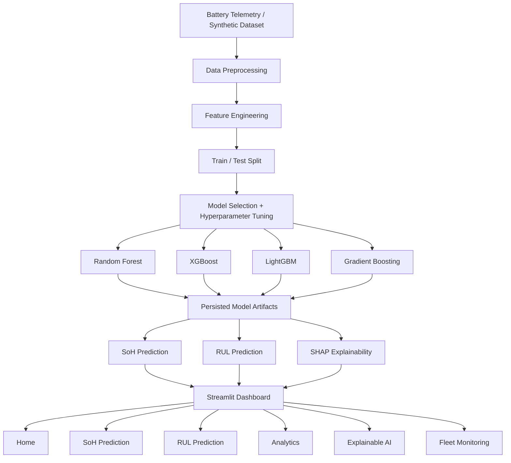
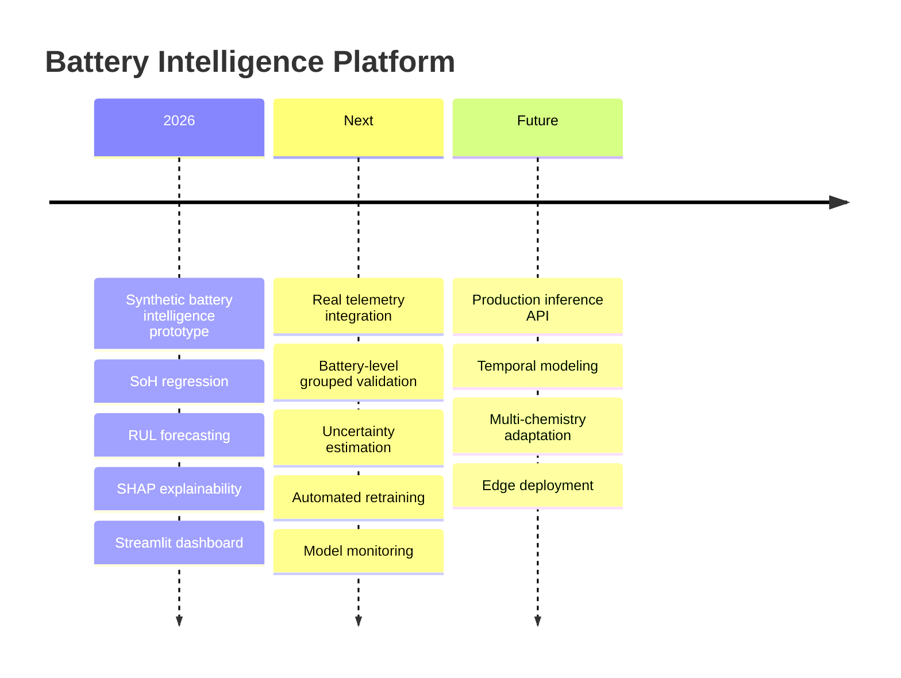

# Battery Intelligence Platform

<p align="center">
  <strong>Machine Learning for EV Battery Health, Degradation & Remaining Life</strong><br/>
  State-of-Health prediction, Remaining Useful Life forecasting, fleet analytics, and explainable AI in one interactive platform.
</p>

<p align="center">
  
  
  
  
  
  
</p>

<p align="center">
  
  
  
  
</p>

<p align="center">
  <a href="#overview">Overview</a> ·
  <a href="#capabilities">Capabilities</a> ·
  <a href="#architecture">Architecture</a> ·
  <a href="#machine-learning-pipeline">ML Pipeline</a> ·
  <a href="#explainable-ai">XAI</a> ·
  <a href="#quick-start">Quick Start</a> ·
  <a href="#limitations">Limitations</a>
</p>

---

## Overview

**Battery Intelligence Platform** is an end-to-end machine learning application for analyzing and forecasting the health of lithium-ion EV batteries.

The platform prepares battery telemetry, engineers degradation-oriented features, compares multiple ensemble regressors, persists model artifacts, and exposes the resulting intelligence through a Streamlit dashboard.

The system focuses on two core prognostics tasks:

- **State of Health (SoH):** estimate current battery health as a percentage.
- **Remaining Useful Life (RUL):** estimate remaining operating cycles relative to the project's defined end-of-life condition.

The platform also provides fleet monitoring, degradation analytics, maintenance-oriented rules, and SHAP-based model interpretation.

> **Project status:** This is an academic and engineering prototype for battery prognostics research and demonstration. It is not a certified battery-management system and should not be used as the sole basis for safety-critical, warranty, maintenance, or vehicle-control decisions.

---

# Capabilities

| Capability | What it provides |
|---|---|
| SoH Prediction | Interactive estimation of battery State of Health |
| RUL Forecasting | Remaining-cycle estimation for lifecycle planning |
| Model Comparison | Random Forest, XGBoost, LightGBM, and Gradient Boosting workflows |
| Explainable AI | Global and local SHAP-based feature attribution |
| Fleet Monitoring | Simulated multi-battery health and risk overview |
| Analytics | Degradation trends, feature relationships, and telemetry analysis |
| Maintenance Rules | Heuristic recommendations based on predicted condition |
| Model Persistence | Serialized models and preprocessing artifacts for inference |

---

# Architecture


```mermaid
flowchart TD
    A["Battery Telemetry / Synthetic Dataset"] --> B["Data Preprocessing"]
    B --> C["Feature Engineering"]
    C --> D["Train / Test Split"]
    D --> E["Model Selection + Hyperparameter Tuning"]

    E --> E1["Random Forest"]
    E --> E2["XGBoost"]
    E --> E3["LightGBM"]
    E --> E4["Gradient Boosting"]

    E1 --> F["Persisted Model Artifacts"]
    E2 --> F
    E3 --> F
    E4 --> F

    F --> G["SoH Prediction"]
    F --> H["RUL Prediction"]
    F --> I["SHAP Explainability"]

    G --> J["Streamlit Dashboard"]
    H --> J
    I --> J

    J --> J1["Home"]
    J --> J2["SoH Prediction"]
    J --> J3["RUL Prediction"]
    J --> J4["Analytics"]
    J --> J5["Explainable AI"]
    J --> J6["Fleet Monitoring"]
```

## System layers

```text
                         BATTERY INTELLIGENCE PLATFORM
                                      │
        ┌─────────────────────────────┼─────────────────────────────┐
        │                             │                             │
        ▼                             ▼                             ▼
   DATA LAYER                 MODELING LAYER                 APP LAYER
        │                             │                             │
        ├─ battery_data.csv           ├─ SoH regression             ├─ Home
        ├─ preprocessing              ├─ RUL regression              ├─ SoH Prediction
        └─ feature engineering        ├─ model selection             ├─ RUL Prediction
                                      └─ persisted artifacts         ├─ Analytics
                                                                    ├─ Explainability
                                                                    └─ Fleet Monitoring
```

---

# Machine Learning Pipeline

## Data preparation

The preprocessing layer prepares telemetry before model training and inference.

Current documented steps include:

1. Missing-value handling.
2. Numerical-column cleaning.
3. IQR-based outlier mitigation.
4. Train/test separation.
5. Standard scaling.
6. Preprocessing metadata export.

```text
Raw telemetry
     ↓
Cleaning & validation
     ↓
Outlier mitigation
     ↓
Feature engineering
     ↓
Scaling
     ↓
Model-ready matrix
```

## Feature engineering

The project creates degradation-oriented features that summarize battery wear and operating stress.

| Feature | Interpretation |
|---|---|
| `capacity_retention_rate` | Relative capacity remaining |
| `resistance_growth_rate` | Relative increase in internal resistance |
| `cycle_efficiency` | Charge/discharge efficiency proxy |
| `degradation_rate` | Estimated rate of capacity loss |
| `temperature_stress_score` | Temperature deviation from the target operating range |
| `battery_wear_index` | Composite wear indicator |
| `avg_charge_temperature` | Rolling thermal indicator |
| `avg_discharge_temperature` | Rolling thermal indicator |
| `voltage_drop` | Charge/discharge voltage differential |
| `cumulative_temp_stress` | Accumulated thermal stress |

---

# Model Development

The platform compares multiple tree-based regressors and selects models through cross-validation.

## State of Health

Current repository metadata records:

```text
Selected model:  Gradient Boosting
CV R²:           0.9999
Learning rate:   0.05
Max depth:       5
Estimators:      200
```

## Remaining Useful Life

Current repository metadata records:

```text
Selected model:  LightGBM
CV R²:           0.9840
Learning rate:   0.10
Max depth:       20
Estimators:      200
```

## Cross-validation results recorded by the project

### SoH

| Model | CV R² |
|---|---:|
| Random Forest | 0.9998 |
| XGBoost | 0.9998 |
| Gradient Boosting | **0.9999** |

### RUL

| Model | CV R² |
|---|---:|
| Random Forest | 0.9781 |
| XGBoost | 0.9813 |
| LightGBM | **0.9840** |

> These values come from the repository's stored model metadata. Because the current development workflow uses synthetic / simulated battery data, these scores do not establish equivalent performance on real-world EV fleets.

---

# Explainable AI

Interpretability is integrated into the platform through **SHAP (SHapley Additive exPlanations)**.

## Global explanation

Global SHAP analysis helps identify which features have the largest average influence on model behavior across the evaluated dataset.

## Local explanation

Local explanations show how individual feature values contribute to a specific prediction relative to the model's baseline expectation.

```text
Prediction
    │
    ▼
Baseline expectation
    │
    ├── Feature contribution +
    ├── Feature contribution -
    ├── Feature contribution +
    └── Feature contribution -
    │
    ▼
Final model output
```

> SHAP describes how a model uses its inputs. It does not prove that a feature is causally responsible for battery degradation.

---

# Dashboard

The Streamlit application currently exposes six major areas.

| Page | Purpose |
|---|---|
| **Home Dashboard** | High-level platform and fleet overview |
| **SoH Prediction** | Interactive battery-health estimation |
| **RUL Prediction** | Remaining-cycle forecasting |
| **Analytics** | Degradation trends and feature relationships |
| **Explainable AI** | Global and local SHAP interpretation |
| **Fleet Monitoring** | Simulated fleet-level health monitoring |

The interface uses the project's custom dark theme from `config.toml` and `style.css`.

---

# Risk & Maintenance Layer

The utility layer maps predicted SoH into application-level categories.

| SoH | Category |
|---:|---|
| 90–100 | Excellent |
| 75–89.99 | Good |
| 60–74.99 | Warning |
| Below 60 | Critical |

The platform additionally derives maintenance-oriented messages using SoH, temperature, internal resistance, and RUL.

These rules are **application heuristics**, not universal battery-manufacturer service thresholds.

---

# Dataset

The project documentation describes a synthetic battery dataset modeled around NASA PCoE-style battery aging profiles.

The documented dataset contains:

- **2,748 simulated cycles**
- Four simulated battery identifiers: `B0005`, `B0006`, `B0007`, `B0018`
- Voltage, current, temperature, capacity, resistance, and charging telemetry

The repository includes `battery_data.csv` for the demonstration workflow.

> Synthetic data is useful for experimentation and software demonstration, but it cannot represent the complete variability of real EV operation.

---

# Repository Structure

```text
-BATTERY-INTELLIGENCE-PLAYTFORM-2026-INTERSHIP-SWIFT-VOLT-VENTURES-/
│
├── app.py
├── analytics.py
├── data_preprocessing.py
├── explainability.py
├── rul_prediction.py
├── soh_prediction.py
├── utils.py
│
├── home.py
├── explainability_dashboard.py
├── fleet_monitoring.py
├── style.css
├── config.toml
│
├── battery_data.csv
├── preprocessing_report.json
├── model_metadata.json
│
├── soh_*.joblib
├── rul_*.joblib
│
├── project_report.md
├── requirements.txt
└── LICENSE
```

The repository also currently contains generated Python cache artifacts such as `__pycache__` and `.pyc` files. These are not required for the source distribution and should normally be excluded from version control.

---

# Module Responsibilities

| Module | Responsibility |
|---|---|
| `app.py` | Streamlit entrypoint and page routing |
| `data_preprocessing.py` | Data cleaning, outlier handling, scaling |
| `analytics.py` | Degradation and dataset analytics |
| `explainability.py` | SHAP utilities |
| `soh_prediction.py` | SoH inference workflow |
| `rul_prediction.py` | RUL inference workflow |
| `fleet_monitoring.py` | Fleet simulation and monitoring |
| `explainability_dashboard.py` | XAI interface |
| `home.py` | Dashboard landing page |
| `utils.py` | Risk classification and shared helpers |
| `style.css` | Custom visual styling |
| `config.toml` | Streamlit configuration |

---

# Quick Start

## Requirements

- Python 3.10+
- Git
- 2 GB+ RAM recommended
- Windows, macOS, or Linux

## Clone

```bash
git clone https://github.com/RITESH2127/-BATTERY-INTELLIGENCE-PLAYTFORM-2026-INTERSHIP-SWIFT-VOLT-VENTURES-.git
cd "-BATTERY-INTELLIGENCE-PLAYTFORM-2026-INTERNSHIP-SWIFT-VOLT-VENTURES-"
```

## Create a virtual environment

### Windows

```powershell
python -m venv .venv
.\.venv\Scripts\Activate.ps1
```

### macOS / Linux

```bash
python3 -m venv .venv
source .venv/bin/activate
```

## Install dependencies

```bash
python -m pip install --upgrade pip setuptools wheel
pip install -r requirements.txt
```

## Run

```bash
streamlit run app.py
```

Open `http://localhost:8501` in your browser.

---

# Programmatic Inference

Persisted model and scaler artifacts can be loaded directly:

```python
import joblib

model = joblib.load("soh_xgboost.joblib")
scaler = joblib.load("soh_scaler.joblib")
```

For reliable inference, the input must use the same feature definitions and ordering expected by the trained artifact.

---

# Reproducibility

A strong experiment record should preserve the complete path from data to deployed artifact.

```text
Dataset version
      ↓
Preprocessing configuration
      ↓
Feature definitions
      ↓
Train/test split
      ↓
Hyperparameters
      ↓
Best estimator
      ↓
Evaluation metrics
      ↓
Serialized artifact
      ↓
Inference environment
```

Recommended next steps include:

- fixed random seeds across all stages,
- dataset versioning,
- model versioning,
- automated feature-engineering tests,
- inference integration tests,
- experiment tracking,
- CI validation,
- explicit dependency locking.

---

# Engineering Considerations

## Synthetic versus real telemetry

Real EV telemetry introduces substantially greater variability than a controlled synthetic dataset, including chemistry, cell variation, thermal history, driving behavior, charging behavior, sensor noise, pack architecture, and aging mechanisms.

## Temporal validation

Battery telemetry is sequential. Random row-level splitting can leak information when adjacent cycles from the same battery appear in both training and test data.

A stronger future evaluation design should use **battery-level grouped and time-aware splits**.

## Confidence estimates

The current utility layer includes model-dependent confidence heuristics. These outputs should not be interpreted as calibrated probabilities without formal calibration and uncertainty evaluation.

## Deployment evolution

A production-oriented architecture could separate:

```text
Telemetry ingestion
        ↓
Feature service
        ↓
Model service
        ↓
Prediction API
        ↓
Time-series / relational storage
        ↓
Monitoring dashboard
```

---

# Limitations

### Synthetic data

The current training workflow is based on simulated battery behavior and cannot establish real-world fleet performance.

### Dataset shift

Models trained on one battery population may not generalize to different chemistries, manufacturers, climates, cell formats, vehicle platforms, or charging profiles.

### RUL definition

RUL depends on a clearly specified end-of-life criterion and consistent degradation trajectory.

### Multimodal safety context

Battery health estimates can be safety-relevant. Outputs should therefore be treated as decision support unless independently validated for the intended environment.

---

# Future Roadmap

## Modeling

- Temporal models for sequential telemetry
- LSTM and GRU baselines
- Temporal Transformers
- Multi-task SoH + RUL learning
- Uncertainty-aware prediction
- Physics-informed machine learning
- Battery-specific transfer learning

## Data

- Real EV telemetry integration
- Larger multi-battery datasets
- Multiple battery chemistries
- Cell-level and pack-level signals
- Environmental metadata
- Time-series dataset versioning

## MLOps

- MLflow experiment tracking
- Model registry
- Automated retraining
- Data validation
- Drift monitoring
- Model monitoring
- Dockerized deployment
- CI/CD

## Serving

- FastAPI inference service
- PostgreSQL / time-series storage
- Event-based telemetry ingestion
- Cloud deployment
- ONNX-based inference where appropriate

---

# Development Roadmap


```mermaid
timeline
    title Battery Intelligence Platform
    2026 : Synthetic battery intelligence prototype
         : SoH regression
         : RUL forecasting
         : SHAP explainability
         : Streamlit dashboard
    Next : Real telemetry integration
         : Battery-level grouped validation
         : Uncertainty estimation
         : Automated retraining
         : Model monitoring
    Future : Production inference API
           : Temporal modeling
           : Multi-chemistry adaptation
           : Edge deployment
```

---

# Responsible Use

This repository is intended for academic work, ML engineering practice, battery analytics experimentation, predictive-maintenance research, and explainable ML demonstrations.

It should not be treated as the sole source for battery safety decisions, warranty decisions, vehicle-control decisions, or production maintenance actions without qualified validation.

---

# References

The project documentation builds on publicly documented battery-aging research and the open-source machine learning ecosystem, including:

- NASA Prognostics Center of Excellence battery-aging resources
- scikit-learn
- XGBoost
- LightGBM
- SHAP
- Streamlit
- Plotly
- NumPy
- Pandas
- Matplotlib
- Seaborn
- Joblib

See [project_report.md](project_report.md) for the detailed technical report and methodology.

---

# License

This project is released under the **MIT License**.

See [LICENSE](LICENSE) for the full license text.

---

# Author

<p align="center">
  <strong>Ritesh Kumar</strong><br/>
  Computer Science Engineering
</p>

<p align="center">
  <a href="https://github.com/RITESH2127">GitHub</a>
  ·
  <a href="https://github.com/RITESH2127/-BATTERY-INTELLIGENCE-PLAYTFORM-2026-INTERSHIP-SWIFT-VOLT-VENTURES-">Repository</a>
</p>

---

<p align="center">
  <sub>From battery telemetry to actionable intelligence.</sub>
</p>
