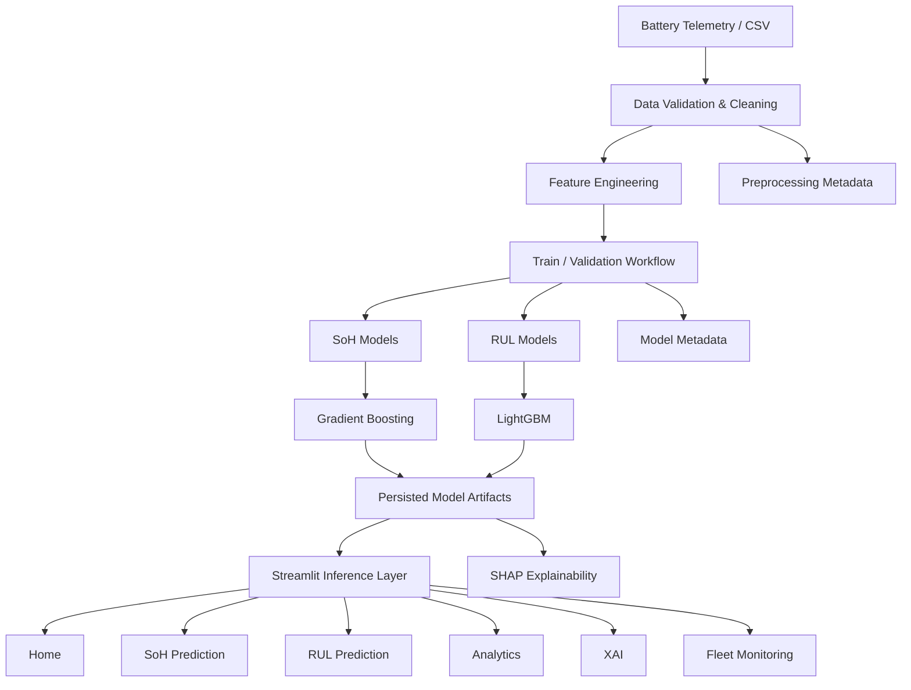
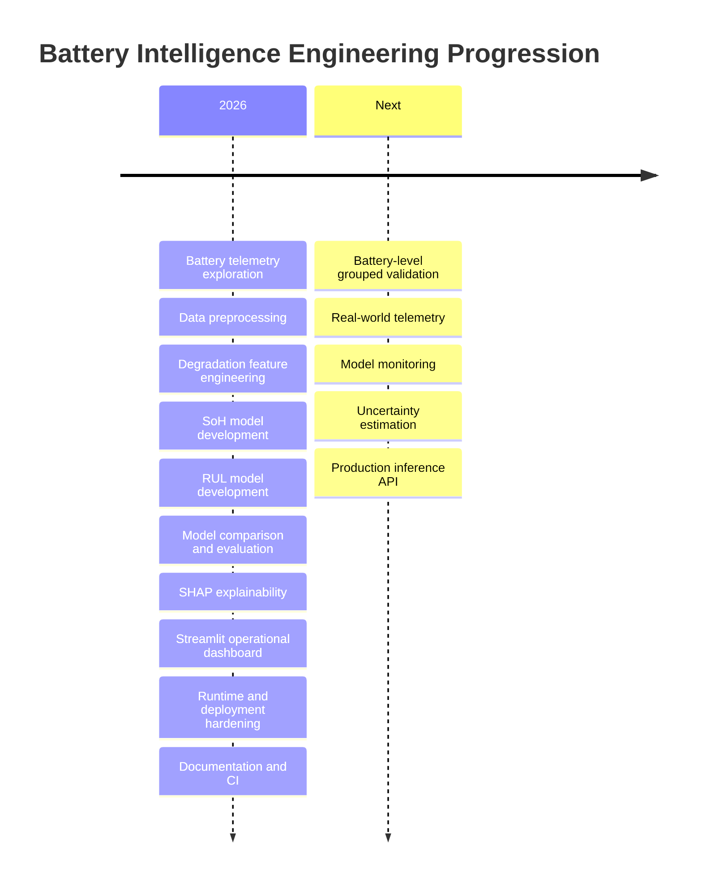

#  Battery Intelligence Platform

<p align="center">
  <strong>Explainable Machine Learning for EV Battery Health, Degradation & Remaining Useful Life</strong><br/>
  An end-to-end battery prognostics platform built with Python, scikit-learn, XGBoost, LightGBM, SHAP and Streamlit.
</p>

<p align="center">
  <a href="https://github.com/RITESH2127/-BATTERY-INTELLIGENCE-PLAYTFORM-2026-INTERSHIP-SWIFT-VOLT-VENTURES-/actions/workflows/ci.yml">
    
  </a>
  
  
  
  
  
  
  
  
</p>

<p align="center">
  <a href="https://hc3gbqd52jpaghs25aj7vq.streamlit.app/">
    
  </a>
</p>

> **Live Demo:** https://hc3gbqd52jpaghs25aj7vq.streamlit.app/  
> Try the deployed Battery Intelligence Platform directly in your browser.

<p align="center">
  <a href="#overview">Overview</a> |
  <a href="#live-demo">Live Demo</a> |
  <a href="#capabilities">Capabilities</a> |
  <a href="#architecture">Architecture</a> |
  <a href="#quick-start">Quick Start</a> |
  <a href="#machine-learning-pipeline">ML Pipeline</a> |
  <a href="#results">Results</a> |
  <a href="#internship-alignment">Internship Alignment</a> |
  <a href="#engineering-standards">Engineering Standards</a>
</p>

---

## Overview

**Battery Intelligence Platform** is an end-to-end machine-learning application for lithium-ion EV battery prognostics.

The system transforms battery telemetry into actionable health intelligence through two primary prediction tasks:

- **State of Health (SoH)** — estimates current battery health as a percentage.
- **Remaining Useful Life (RUL)** — estimates remaining operating cycles before the project-defined end-of-life threshold.

The platform combines data preprocessing, degradation-oriented feature engineering, ensemble regression, model persistence, interactive inference, fleet analytics and SHAP-based explainability in a single Streamlit application.

> **Important:** This repository is an academic and engineering prototype. Its predictions are not certified battery-management-system outputs and must not be used as the sole basis for safety-critical, warranty, vehicle-control or production maintenance decisions.

### Why this project matters

EV battery systems generate rich sequential telemetry, but raw measurements alone do not directly answer operational questions such as:

- How healthy is this battery?
- How many useful cycles remain?
- Which measurements are driving the prediction?
- Which batteries in a fleet require attention?
- How can an ML model be moved from experimentation toward a repeatable deployment workflow?

This project demonstrates the complete path from telemetry to an interactive ML decision-support interface.

---

## Capabilities

| Capability | Implementation |
|---|---|
|  SoH Prediction | Gradient Boosting regression |
|  RUL Forecasting | LightGBM regression |
|  Model Comparison | Random Forest, XGBoost, Gradient Boosting, LightGBM |
|  Explainable AI | Global and local SHAP analysis |
|  Analytics | Capacity fade, thermal behavior, correlations and degradation trends |
|  Fleet Monitoring | Deterministic simulated fleet dashboard |
|  Maintenance Layer | Rule-based condition and lifecycle recommendations |
|  Model Persistence | Joblib model and scaler artifacts |
|  Interactive UI | Multi-page Streamlit application |
|  Containerization | Docker + Docker Compose |
|  Quality Automation | GitHub Actions + compile + smoke tests |
|  Reproducible Setup | Constrained dependency major versions |
|  Documentation | Technical report + engineering README |

---

## Live Demo

The latest deployed Streamlit application is available here:

**[Open Battery Intelligence Platform](https://hc3gbqd52jpaghs25aj7vq.streamlit.app/)**

Use the live deployment to explore the six dashboard views without installing Python dependencies locally.

---

## Dashboard

The Streamlit application provides six operational views:

1. **Home Dashboard** — platform overview and battery-health KPIs.
2. **SoH Prediction** — interactive battery-health inference.
3. **RUL Prediction** — remaining-cycle estimation and degradation forecast.
4. **Analytics** — battery degradation and telemetry analysis.
5. **Explainable AI** — global feature importance and individual prediction explanations.
6. **Fleet Monitoring** — simulated fleet health, search, filtering and inspection.

---

## Architecture

### System architecture


```mermaid
flowchart TD
    A["Battery Telemetry / CSV"] --> B["Data Validation & Cleaning"]
    B --> C["Feature Engineering"]
    C --> D["Train / Validation Workflow"]

    D --> E1["SoH Models"]
    D --> E2["RUL Models"]

    E1 --> F1["Gradient Boosting"]
    E2 --> F2["LightGBM"]

    F1 --> G["Persisted Model Artifacts"]
    F2 --> G

    G --> H["Streamlit Inference Layer"]
    G --> I["SHAP Explainability"]

    H --> J1["Home"]
    H --> J2["SoH Prediction"]
    H --> J3["RUL Prediction"]
    H --> J4["Analytics"]
    H --> J5["XAI"]
    H --> J6["Fleet Monitoring"]

    B --> K["Preprocessing Metadata"]
    D --> L["Model Metadata"]
```

### Runtime flow

```text
                    ┌─────────────────────────┐
                    │   Battery Telemetry     │
                    │      battery_data.csv   │
                    └────────────┬────────────┘
                                 │
                                 ▼
                    ┌─────────────────────────┐
                    │ Cleaning + Validation   │
                    │ Missing values / IQR    │
                    └────────────┬────────────┘
                                 │
                                 ▼
                    ┌─────────────────────────┐
                    │ Feature Engineering     │
                    │ Wear / thermal / cycle  │
                    │ degradation indicators  │
                    └────────────┬────────────┘
                                 │
                    ┌────────────┴────────────┐
                    ▼                         ▼
             ┌─────────────┐           ┌─────────────┐
             │    SoH      │           │     RUL     │
             │ Regression  │           │ Regression  │
             └──────┬──────┘           └──────┬──────┘
                    │                         │
                    ▼                         ▼
             Gradient Boosting              LightGBM
                    │                         │
                    └────────────┬────────────┘
                                 ▼
                    ┌─────────────────────────┐
                    │ Persisted Models/Scalers│
                    └────────────┬────────────┘
                                 │
              ┌──────────────────┼──────────────────┐
              ▼                  ▼                  ▼
        Streamlit UI          SHAP XAI        Fleet Analytics
```

### Repository architecture

The repository intentionally keeps the existing application modules at the project root to preserve compatibility with the original implementation while correcting the historical `src.*` import and path mismatches.

```text
.
├── app.py                         # Streamlit entrypoint
├── home.py                        # Home dashboard
├── soh_prediction.py              # SoH inference UI
├── rul_prediction.py              # RUL inference UI
├── analytics.py                   # Analytics dashboard
├── explainability.py              # SHAP utilities
├── explainability_dashboard.py    # XAI dashboard
├── fleet_monitoring.py            # Fleet dashboard
├── feature_engineering.py         # Feature definitions + transformations
├── data_preprocessing.py           # Cleaning, splitting, scaling
├── model_training.py              # Training + hyperparameter search
├── model_evaluation.py            # Metrics + plotting helpers
├── utils.py                       # Shared business/application utilities
├── app_paths.py                   # Canonical data/model artifact paths
├── generate_dataset.py            # Synthetic dataset generator
├── battery_data.csv               # Demonstration dataset
│
├── *_*.joblib                     # Persisted model/scaler artifacts
├── model_metadata.json             # Selected models + feature metadata
├── preprocessing_report.json       # Dataset/preprocessing metadata
│
├── .streamlit/config.toml         # Streamlit runtime configuration
├── Dockerfile                     # Container image
├── compose.yaml                   # Docker Compose entrypoint
├── .env.example                   # Environment template
├── requirements.txt               # Runtime dependencies
├── pyproject.toml                 # Python project metadata
├── tests/                          # Automated tests
├── scripts/                        # Run/train/smoke-test helpers
├── .github/workflows/ci.yml        # Continuous integration
├── project_report.md               # Detailed technical report
├── MODEL_CARD.md                   # ML model card and risk/usage documentation
├── CONTRIBUTING.md                 # Development and contribution workflow
├── ritesh.pdf                     # Repository-provided credential/document artifact
└── LICENSE                         # MIT license
```

---

## Dataset

The demonstration workflow contains **2,748 simulated battery cycles** across four battery identifiers:

- `B0005`
- `B0006`
- `B0007`
- `B0018`

The generated telemetry contains electrical, thermal and degradation-related measurements such as:

- cycle number
- measured voltage
- measured current
- measured temperature
- charging voltage
- charging current
- capacity
- internal resistance
- ambient temperature

The dataset is modeled around NASA PCoE-style battery-aging profiles for experimentation and software demonstration.

### Data limitation

The current dataset is **synthetic/simulated**. Excellent performance on this dataset must not be interpreted as equivalent performance on independent real-world EV fleets.

A production evaluation should include:

- battery-level grouped splits
- time-aware validation
- unseen battery validation
- chemistry diversity
- sensor noise
- environmental variability
- charging-pattern variability
- external test datasets

---

## Machine Learning Pipeline

### 1. Data preparation

The preprocessing layer performs:

1. CSV loading
2. Missing-value handling
3. IQR-based outlier detection
4. Outlier clipping
5. Feature engineering
6. Train/test separation
7. StandardScaler fitting on training data
8. Preprocessing metadata generation

The current stored preprocessing report records:

- **2,748 rows**
- **12 raw columns**
- **22 engineered columns**
- **2,198 training rows**
- **550 test rows**
- no missing values in the stored dataset
- no detected IQR outliers in the stored preprocessing run

### 2. Feature engineering

The project derives degradation-oriented indicators including:

| Feature | Purpose |
|---|---|
| `capacity_retention_rate` | Relative remaining capacity |
| `resistance_growth_rate` | Relative internal-resistance growth |
| `cycle_efficiency` | Charge/discharge efficiency proxy |
| `degradation_rate` | Capacity-loss velocity |
| `temperature_stress_score` | Operating-temperature stress |
| `battery_wear_index` | Composite wear indicator |
| `avg_charge_temperature` | Rolling thermal condition |
| `avg_discharge_temperature` | Rolling discharge thermal condition |
| `voltage_drop` | Charge/discharge voltage differential |
| `cumulative_temp_stress` | Accumulated thermal stress |

### 3. Model development

The project compares tree-based ensemble regressors and persists the selected models.

#### SoH

**Selected model:** Gradient Boosting Regressor

Stored project metadata:

- learning rate: `0.05`
- maximum depth: `5`
- estimators: `200`
- cross-validation (R²): **0.9999**

#### RUL

**Selected model:** LightGBM Regressor

Stored project metadata:

- learning rate: `0.10`
- maximum depth: `20`
- estimators: `200`
- cross-validation (R²): **0.9840**

### 4. Explainability

SHAP is used to expose:

- global feature importance
- local feature contributions
- directional influence on individual predictions
- prediction breakdowns relative to model expectations

> SHAP explains how the trained model uses its inputs. It does not establish causal relationships between a telemetry variable and physical battery degradation.

---

## Results

The repository's stored model metadata records the following cross-validation results:

### SoH

| Model | CV (R²) |
|---|---:|
| Random Forest | 0.9998 |
| XGBoost | 0.9998 |
| Gradient Boosting | **0.9999** |

### RUL

| Model | CV (R²) |
|---|---:|
| Random Forest | 0.9781 |
| XGBoost | 0.9813 |
| LightGBM | **0.9840** |

These values describe the project's stored evaluation run on the current simulated dataset.

### Evaluation caution

Battery telemetry is sequential and multiple observations originate from the same battery. Random row-level splitting can produce overly optimistic estimates because neighboring cycles may be highly correlated.

The next rigorous evaluation step is therefore **battery-level grouped and time-aware validation**. The current repository documentation already identifies this as an important limitation.

---

## Quick Start

### Option A — Local Python

**Requirements**

- Python 3.10–3.12
- Git
- 2 GB+ RAM recommended

Clone the repository:

```bash
git clone https://github.com/RITESH2127/-BATTERY-INTELLIGENCE-PLAYTFORM-2026-INTERSHIP-SWIFT-VOLT-VENTURES-.git
cd -- "-BATTERY-INTELLIGENCE-PLAYTFORM-2026-INTERSHIP-SWIFT-VOLT-VENTURES-"
```

Create a virtual environment:

**Windows PowerShell**

```powershell
python -m venv .venv
.\.venv\Scripts\Activate.ps1
```

**macOS/Linux**

```bash
python3 -m venv .venv
source .venv/bin/activate
```

Install dependencies:

```bash
python -m pip install --upgrade pip
python -m pip install -r requirements.txt
```

Launch:

```bash
streamlit run app.py
```

Open:

```text
http://localhost:8501
```

### Option B — Windows helper

PowerShell:

```powershell
$env:APP_PORT = "8501"
scripts\run.ps1
```

### Option C — Docker

Build and run:

```bash
docker build -t battery-intelligence-platform:local .
docker run --rm -p 8501:8501 battery-intelligence-platform:local
```

Then open:

```text
http://localhost:8501
```

### Option D — Docker Compose

No database or external service is required for the default application.

```bash
docker compose up --build
```

Open:

```text
http://localhost:8501
```

Stop:

```bash
docker compose down
```

The container exposes a Streamlit health endpoint and includes a Docker healthcheck.

---

## Configuration

The default project requires **no secrets**.

A template is provided at:

```text
.env.example
```

Copy it when local environment customization is desired:

```bash
cp .env.example .env
```

On Windows PowerShell:

```powershell
Copy-Item .env.example .env
```

The primary runtime setting is:

```text
APP_PORT=8501
```

The project intentionally does not require a database for its current demonstration workflow.

---

## Training from Scratch

The repository includes the complete preprocessing and model-training pipeline.

Run:

```bash
python -m model_training
```

or:

```bash
bash scripts/train.sh
```

Training generates/updates:

```text
soh_*.joblib
rul_*.joblib
soh_scaler.joblib
rul_scaler.joblib
model_metadata.json
preprocessing_report.json
```

### Important

Training is more computationally expensive than running the already-persisted application models because the workflow performs model comparison and hyperparameter search.

For the fastest demo, use the persisted artifacts already included in the repository. The Streamlit pages resolve these root-level artifacts automatically; no manual models/ or data/ directory setup is required.

---

## Verification & Quality Gates

The repository now includes lightweight automated checks.

### Compile all Python sources

```bash
python -m compileall -q .
```

### Run the smoke test

```bash
python scripts/smoke_test.py
```

### Run tests

```bash
pytest
```

### Continuous Integration

Every push to the main/refactor branches and every pull request targeting `main` runs:

1. Python setup
2. Dependency installation
3. Python compilation
4. Dataset/feature-engineering smoke test
5. Streamlit entrypoint import validation

Workflow:

```text
.github/workflows/ci.yml
```


### Streamlit troubleshooting

If the application opens but a prediction or analytics page previously reported missing models/data, update to the latest repository version. The application now uses a centralized path resolver for the root-level dataset and persisted model artifacts.

The included artifacts are:

- `battery_data.csv`
- `model_metadata.json`
- `soh_gradient_boosting.joblib`
- `soh_scaler.joblib`
- `rul_lightgbm.joblib`
- `rul_scaler.joblib`

Run the smoke test before starting Streamlit:

```bash
python scripts/smoke_test.py
streamlit run app.py
```

The sidebar navigation uses stable page names independent of emoji or browser font rendering.

---

## Container Design

The Docker image follows a simple production-oriented pattern:

```text
Python 3.12 slim
       │
       ├── Install pinned major-version dependencies
       │
       ├── Copy application
       │
       ├── Run as non-root user
       │
       ├── Expose 8501
       │
       ├── Healthcheck /_stcore/health
       │
       └── Start Streamlit
```

The container is deliberately stateless. Model artifacts and the demonstration dataset are packaged with the application.

---

## Security & Responsible Use

This application loads serialized Joblib artifacts. Joblib ultimately relies on Python serialization mechanisms, so model files should be treated as **trusted application artifacts**.

Do not load arbitrary model files supplied by untrusted users.

For a production deployment, add:

- authenticated access
- TLS termination
- secret management
- signed/versioned model artifacts
- model provenance
- data-access controls
- audit logging
- model-drift monitoring
- dependency vulnerability scanning
- container image scanning

The current application is a decision-support prototype, not a certified BMS or safety controller.

---

## Engineering Standards

The refactored repository introduces the following engineering practices:

### Code quality

- consistent root-level imports
- deterministic local paths
- explicit dependency version bounds
- defensive empty-state handling
- reusable utility modules
- modular preprocessing/modeling/dashboard layers

### Reproducibility

- persisted models
- persisted scalers
- model metadata
- preprocessing metadata
- fixed random seeds where simulation is used
- explicit Python version range
- dependency major-version constraints

### DevOps

- Dockerfile
- Docker Compose
- healthcheck
- non-root container user
- environment template
- GitHub Actions CI
- smoke tests
- local run scripts

### Documentation

- architecture diagrams
- ML pipeline description
- limitations
- operational setup
- training workflow
- deployment workflow
- responsible-use guidance
- internship alignment

---

## Internship Alignment

This repository represents work completed during the **Machine Learning Engineer** internship at **Swift Volt Ventures**. The official internship certificate records the internship period as **June 16, 2026 to August 16, 2026**, and states that the internship requirements were successfully fulfilled.

The engineering scope represented by this repository maps directly to the practical ML workflow expected from an internship project:

| Internship-oriented capability | Evidence in this repository |
|---|---|
| Python development | Modular Python application and ML pipeline |
| Data preprocessing | Missing-value handling, outlier mitigation, scaling |
| Feature engineering | Battery degradation and thermal features |
| Model development | Multiple ensemble regression algorithms |
| Model evaluation | Cross-validation and regression metrics |
| End-to-end ML pipeline | Data → preprocessing → features → training → artifacts → inference |
| Explainability | SHAP global/local analysis |
| Deployment orientation | Streamlit + Docker + Compose |
| Testing | Smoke tests + CI |
| Documentation | README + technical report |
| Git/version control | GitHub repository + CI workflow |
| Engineering discipline | Reproducible configuration and runtime tooling |

### Internship Skill Matrix

| Skill area | Repository evidence |
|---|---|
| Python | Modular application, preprocessing, training, analytics and inference modules |
| Data preprocessing | Missing-value handling, IQR outlier mitigation, scaling and validation |
| Feature engineering | Battery degradation, resistance, efficiency and thermal indicators |
| Machine learning | Random Forest, XGBoost, Gradient Boosting and LightGBM |
| Model selection | GridSearchCV-based hyperparameter search and model selection |
| Model evaluation | R2-based cross-validation, regression metrics and documented limitations |
| Explainable AI | SHAP global and local explanations |
| Deployment | Streamlit application, Dockerfile and Docker Compose |
| Testing | Smoke tests, pytest configuration and CI workflow |
| Version control | GitHub repository, pull-request workflow and CI |
| Documentation | Technical report, architecture diagrams and reproducible setup instructions |
| Engineering discipline | Persisted artifacts, metadata, configuration and responsible-use documentation |

### Internship project progression


```mermaid
timeline
    title Battery Intelligence Engineering Progression
    2026 : Battery telemetry exploration
         : Data preprocessing
         : Degradation feature engineering
         : SoH model development
         : RUL model development
         : Model comparison and evaluation
         : SHAP explainability
         : Streamlit operational dashboard
         : Runtime and deployment hardening
         : Documentation and CI
    Next : Battery-level grouped validation
         : Real-world telemetry
         : Model monitoring
         : Uncertainty estimation
         : Production inference API
```

### Professional relevance

SwiftVolt Ventures operates in electric mobility and lithium-ion battery technology, making battery health, lifecycle estimation, telemetry analytics and predictive maintenance directly relevant engineering themes for this project. The company's public materials describe its focus on electric two-wheelers and lithium-ion battery systems. 

---

## Internship Certificate & Credentials

The repository includes the original internship completion certificate issued by **Swift Volt Ventures**.

### Swift Volt Ventures Internship Certificate

| Field | Certificate record |
|---|---|
| Candidate | **Ritesh Kumar** |
| Institution | **Bharati Vidyapeeth College of Engineering, New Delhi** |
| Role | **Machine Learning Engineer** |
| Organization | **Swift Volt Ventures** |
| Internship period | **June 16, 2026 to August 16, 2026** |
| Certificate date | **August 16, 2026** |
| Issued by | **Anurag, Director** |
| Certificate status | **Internship requirements successfully fulfilled** |

The certificate states that Ritesh Kumar successfully fulfilled the internship requirements as a Machine Learning Engineer at Swift Volt Ventures from June 16, 2026 to August 16, 2026. It also records that he demonstrated sincerity, courtesy, a result-oriented approach, adaptability, and effective contribution to the team.

**Original certificate:** [View the internship certificate PDF](ritesh.pdf)

### Publicly listed learning credentials

The author's public professional profile also lists:

| Credential | Issuer | Issued |
|---|---|---|
| Python Course | GeeksforGeeks | June 2026 |
| AI Fluency for Students | Anthropic | March 2026 |
| Machine Learning | GeeksforGeeks | January 2026 |
| Machine Learning | GAIL (India) Limited | September 2025 |

Credential claims should be verified against the issuing organization's credential record or the original certificate.
---

## Current Project Snapshot

| Metric | Value |
|---|---:|
| Simulated battery cycles | **2,748** |
| Battery identifiers | **4** |
| Engineered features | **10+** |
| SoH CV (R²) | **0.9999** |
| RUL CV (R²) | **0.9840** |
| Dashboard pages | **6** |
| Fleet simulation | **25 batteries** |
| Explainability | **SHAP** |
| Containerization | **Docker** |
| CI | **GitHub Actions** |

---

## Production Roadmap

### Phase 1 — Validation hardening

- [ ] Battery-level grouped cross-validation
- [ ] Time-aware evaluation
- [ ] Holdout battery evaluation
- [ ] External dataset validation
- [ ] Confidence/uncertainty calibration

### Phase 2 — Data engineering

- [ ] Real EV telemetry ingestion
- [ ] Time-series storage
- [ ] Schema validation
- [ ] Data-quality monitoring
- [ ] Dataset versioning

### Phase 3 — ML engineering

- [ ] MLflow experiment tracking
- [ ] Model registry
- [ ] Automated retraining
- [ ] Drift detection
- [ ] Champion/challenger evaluation
- [ ] Feature-store integration where justified

### Phase 4 — Serving

```text
Telemetry
   ↓
Ingestion API
   ↓
Validation
   ↓
Feature Service
   ↓
Model Service
   ↓
Prediction API
   ↓
Time-Series Database
   ↓
Monitoring / Dashboard
```

Potential production technologies include FastAPI, PostgreSQL/time-series storage, MLflow, Docker and cloud-native deployment.

### Phase 5 — Advanced battery intelligence

- temporal models
- LSTM/GRU baselines
- Temporal Transformers
- multi-task SoH + RUL learning
- uncertainty-aware forecasting
- physics-informed ML
- chemistry transfer learning
- anomaly detection
- edge inference / ONNX

---

## Known Limitations

### Synthetic data

The current training dataset is simulated and therefore does not capture the full variability of real EV fleets.

### Sequential leakage risk

Random row-level splitting is weaker than battery-level and time-aware evaluation for sequential degradation data.

### Dataset shift

A model trained on one battery population may not generalize to another chemistry, manufacturer, climate, cell format or operating regime.

### RUL definition

RUL is dependent on the chosen end-of-life criterion. This project uses a **70% SoH threshold** for its demonstration workflow.

### Heuristic recommendations

Maintenance messages are application heuristics, not manufacturer service thresholds.

### Confidence output

The application's confidence/stability display should not be interpreted as a calibrated probability unless formal uncertainty calibration has been performed.

---

## Technical Design Principles

This project follows five core principles:

1. **Modularity** — preprocessing, feature engineering, modeling, explanation and UI are separated.
2. **Reproducibility** — model and preprocessing artifacts are persisted.
3. **Interpretability** — predictions are accompanied by SHAP analysis.
4. **Deployability** — the application can run locally or inside Docker.
5. **Responsible ML** — limitations and dataset assumptions are explicitly documented.

---

## References

1. NASA Prognostics Center of Excellence — battery aging resources.
2. Lundberg, S. M. & Lee, S.-I. — *A Unified Approach to Interpreting Model Predictions*, NeurIPS 2017.
3. Chen, T. & Guestrin, C. — *XGBoost: A Scalable Tree Boosting System*, KDD 2016.
4. Ke, G. et al. — *LightGBM: A Highly Efficient Gradient Boosting Decision Tree*, NeurIPS 2017.
5. scikit-learn documentation.
6. Streamlit documentation.
7. SHAP documentation.

---

## Project Documentation

For the detailed technical methodology, mathematical formulations, feature definitions, model grids, evaluation tables and engineering discussion, see:

**[Technical Project Report →](project_report.md)**

**[Model Card →](MODEL_CARD.md)** | **[Contribution Guide →](CONTRIBUTING.md)**

---

## Useful Links

- **Repository:** https://github.com/RITESH2127/-BATTERY-INTELLIGENCE-PLAYTFORM-2026-INTERSHIP-SWIFT-VOLT-VENTURES-
- **Author GitHub:** https://github.com/RITESH2127
- **SwiftVolt Ventures:** https://swiftvoltventures.com/
- **License:** MIT

---

## Author

<p align="center">
  <strong>Ritesh Kumar</strong><br/>
  Computer Science Engineering<br/>
  Battery Intelligence Platform
</p>

<p align="center">
  <sub>From battery telemetry to explainable intelligence.</sub>
</p>

---

## License

This project is released under the **MIT License**.

See [LICENSE](LICENSE) for the complete license text.

---

<p align="center">
  <strong>Battery Intelligence Platform</strong><br/>
  <sub>Machine Learning | Explainable AI | EV Battery Prognostics | Deployment Engineering</sub>
</p>
