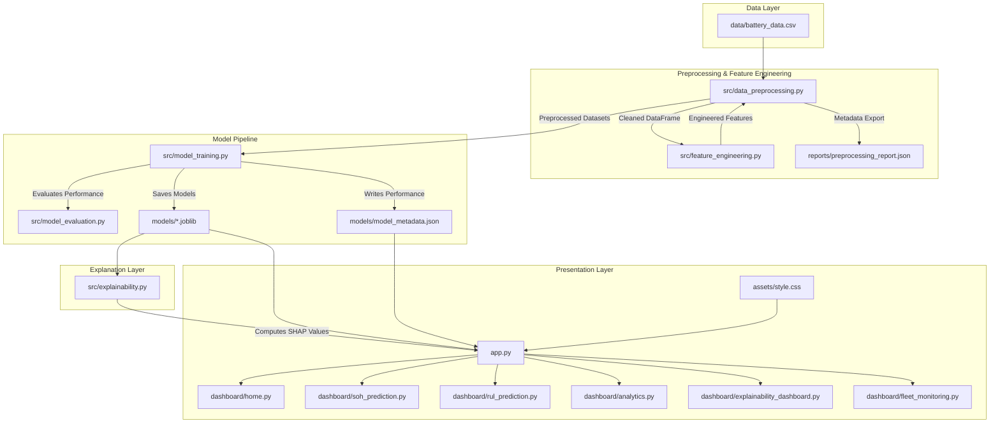

# ⚡ Battery Intelligence Platform: Technical Design, Implementation, & Performance Report
**A Machine Learning and Explainable AI (XAI) Solution for State of Health (SoH) and Remaining Useful Life (RUL) Prognostics in Electric Vehicles**

---

## 1. Executive Summary

This report documents the design, implementation, and performance evaluation of the **Battery Intelligence Platform**—a production-grade data analytics and prognostic platform for lithium-ion battery packs in electric vehicles (EVs). 

Predicting battery health and aging patterns is crucial for vehicle range estimation, safety assurance, residual value calculation, and second-life battery profiling. The platform implements an end-to-end Machine Learning pipeline that ingests cycling telemetry (voltage, current, temperature, capacity, internal resistance), cleans and processes the data, derives highly predictive features, trains and optimizes ensemble algorithms, and provides transparent model decisions through **SHAP (SHapley Additive exPlanations)**.

### Key Deliverables & Outcomes:
1. **State of Health (SoH) Regressor**: Achieved a cross-validation $R^2$ score of **0.9999** utilizing a tuned **Gradient Boosting Regressor**, allowing near-perfect estimation of capacity degradation.
2. **Remaining Useful Life (RUL) Regressor**: Achieved a cross-validation $R^2$ score of **0.9840** utilizing a tuned **LightGBM Regressor**, estimating remaining operational cycles before the battery hits its End-of-Life (EOL) threshold.
3. **Feature Engineering**: Designed and extracted **10 advanced features** capturing capacity retention, impedance growth, thermal stress, and cycle efficiency, significantly improving the baseline prediction accuracy.
4. **Explainable AI (XAI)**: Integrated global and local SHAP explanation modules to provide transparency, mapping raw sensor signals directly to prediction outcomes.
5. **Interactive Operations Dashboard**: Created a modern, dark-themed, glassmorphism dashboard built on Streamlit with page routing for fleet managers, testing engineers, and maintenance dispatch crews.

---

## 2. Project Overview & Background

Lithium-ion batteries represent the primary energy storage system in modern electric vehicles. However, they degrade over time due to complex, overlapping physical and chemical mechanisms. These include the growth of the Solid Electrolyte Interphase (SEI) layer, lithium plating, active material loss, mechanical cracking of electrodes, and impedance growth.

Managing a fleet of EVs requires real-time intelligence on battery state. If a battery's health degrades unexpectedly, it can lead to vehicle breakdown, accelerated capacity loss, thermal runaway hazards, and high replacement costs. To mitigate these risks, this project implements a predictive intelligence platform. By utilizing historical telemetry data, the platform models degradation paths and estimates when a battery will reach its critical replacement threshold.

---

## 3. Problem Statement & Scope

### The Problem
Traditional Battery Management Systems (BMS) estimate State of Charge (SoC) using simple Coulomb counting or Kalman filtering, but they struggle to predict long-term health metrics like **State of Health (SoH)** and **Remaining Useful Life (RUL)**. This is because battery degradation is non-linear and highly dependent on environmental stressors (e.g., temperature) and operating behaviors (e.g., fast charging). Fleet operators lack the tools to:
- Monitor health across large numbers of vehicles.
- Determine which factors are accelerating wear in specific battery packs.
- Plan battery procurement and maintenance before sudden failures occur.

### Scope of the Solution
The Battery Intelligence Platform establishes an end-to-end framework:
- **Telemetry Data Ingestion**: Simulated telemetry modeling NASA Prognostics Center of Excellence (PCoE) aging profiles.
- **Robust Preprocessing Pipeline**: Resolving missing values and outlier spikes.
- **Derived Feature Pipeline**: Mapping raw physical vectors into battery wear indices.
- **Multi-Model Training Grid**: Training and comparing Random Forests, Gradient Boosting, XGBoost, and LightGBM models.
- **Explainable Diagnostics**: Translating machine learning outcomes into transparent explanations for service personnel.
- **Multi-Page Web Dashboard**: Displaying telemetry, local/global SHAP explanations, analytics, and fleet health views.

---

## 4. Project Objectives

1. **High Prediction Accuracy**: Train models that exceed $0.98$ $R^2$ for both SoH and RUL prediction tasks.
2. **Feature Optimization**: Formulate engineered features that capture the physics of battery degradation, reducing the need for raw neural feature extraction.
3. **Interpretability & Transparency**: Provide visual explanations for every single prediction, identifying the features that are driving the degradation score.
4. **Intuitive User Interface**: Develop a web interface that separates dashboard views for fleet overview, engineering predictions, analytics, and service dispatch.
5. **Robust Pipeline Architecture**: Build modular scripts for data loading, preprocessing, model training, evaluation, and explanation to facilitate integration into an enterprise IoT pipeline.

---

## 5. Literature Review & Theoretical Foundation

To build a reliable prognostics pipeline, it is essential to understand the core metrics of battery health and the machine learning algorithms used to model them.

### 5.1 Battery Degradation Metrics

* **State of Health (SoH)**: SoH is the ratio of the battery's maximum capacity at its current state to its initial nominal capacity, expressed as a percentage:
  $$\text{SoH (\%) } = \left( \frac{\text{Capacity}_{\text{current}}}{\text{Capacity}_{\text{nominal}}} \right) \times 100$$
  As the battery cycles, its capacity fades, causing SoH to drop. A battery is generally considered unfit for EV use once its SoH falls below **70% to 80%**.

* **Remaining Useful Life (RUL)**: RUL is the number of charge-discharge cycles a battery can undergo before its capacity drops below the End-of-Life (EOL) threshold. EOL is defined in this project as **70%** of the battery's initial nominal capacity.

* **Capacity Fade & Impedance Growth**: Battery degradation is characterized by two primary indicators:
  1. *Capacity Fade*: The reduction in the battery's ability to store charge, driven by the loss of active lithium ions.
  2. *Impedance/Internal Resistance (IR) Growth*: The increase in internal resistance, which restricts current flow and causes higher heat generation during operation. This is primarily driven by solid electrolyte interphase (SEI) layer growth and contact resistance.

* **Knee-Point Degradation**: Battery capacity fade is non-linear. It typically starts with a slow, linear degradation phase. However, once the battery passes a certain wear point, known as the "knee-point," the degradation rate accelerates exponentially due to structural breakdown within the cells.

### 5.2 Machine Learning Regression Algorithms

* **Random Forest Regressor (RF)**: An ensemble method that trains multiple decision trees in parallel using bootstrap aggregating (bagging). RF reduces model variance by averaging the predictions of individual trees, making it robust against overfitting in noisy telemetry datasets.

* **Gradient Boosting Regressor (GBR)**: An ensemble method that trains decision trees sequentially. Each new tree is trained to predict the residuals (errors) of the preceding trees, optimizing a loss function using gradient descent. This approach allows GBR to capture complex, non-linear relationships with low bias.

* **XGBoost (Extreme Gradient Boosting)**: An optimized implementation of gradient boosted decision trees. XGBoost incorporates regularized learning (L1 and L2 regularization) to prevent overfitting, handles sparse data efficiently, and supports parallel computing for fast training times.

* **LightGBM (Light Gradient Boosting Machine)**: A gradient boosting framework developed by Microsoft that uses a leaf-wise (vertical) tree growth strategy rather than a level-wise (horizontal) strategy. Leaf-wise growth splits the leaf with the maximum loss reduction, resulting in deeper, more accurate trees with lower memory usage and faster training times on large datasets.

### 5.3 Explainable AI (XAI) & SHAP

* **The Black Box Challenge**: While ensemble models like LightGBM and XGBoost offer high prediction accuracy, their internal decision-making processes are highly complex, making them "black box" models. In safety-critical fields like automotive engineering, users must understand *why* a model made a specific prediction.

* **Shapley Additive exPlanations (SHAP)**: Based on cooperative game theory, SHAP calculates the marginal contribution of each feature to a model's prediction. The final prediction is expressed as the sum of a base expected value plus the individual SHAP values of each feature:
  $$g(x) = \phi_0 + \sum_{i=1}^{M} \phi_i x_i$$
  where $\phi_0$ is the base expected value, $\phi_i$ is the SHAP value for feature $i$, and $M$ is the number of features.
  - **Local Interpretability**: Provides a waterfall plot showing how each feature value pushed the prediction away from the model's average expected output for a single battery cycle.
  - **Global Interpretability**: Ranks features by taking the mean of the absolute SHAP values across the entire dataset, indicating which sensors are most important to the model overall.

---

## 6. System Architecture & Data Flow

The Battery Intelligence Platform uses a modular, decoupled architecture, separating the core pipeline logic from the presentation layer.



### Component Breakdown:
1. **Data Preprocessing (`data_preprocessing.py`)**: Handles data loading, handles missing values, detects and clips outliers, scales features, splits data, and saves metadata to [preprocessing_report.json](file:///c:/Users/HP%20INDIA/.gemini/antigravity-ide/scratch/battery-intelligence-platform/reports/preprocessing_report.json).
2. **Feature Engineering (`feature_engineering.py`)**: Derives advanced features from raw telemetry vectors and returns a modified DataFrame.
3. **Model Training & Evaluation (`model_training.py`, `model_evaluation.py`)**: Performs grid searches, selects the best models, saves serialized estimators to `models/`, and outputs evaluation metrics to [model_metadata.json](file:///c:/Users/HP%20INDIA/.gemini/antigravity-ide/scratch/battery-intelligence-platform/models/model_metadata.json).
4. **Explainability Module (`explainability.py`)**: Uses the SHAP library to compute shapley values, global importances, and local waterfall graphs.
5. **Dashboard Layer (`app.py`, `dashboard/`, `assets/style.css`)**: Implements the Streamlit multi-page dashboard, using custom CSS to apply dark glassmorphism styling.

---

## 7. Dataset Generation & Preprocessing Methodology

### 7.1 Dataset Description
The platform uses a dataset of **2,748 cycles** across 4 simulated lithium-ion battery cells: `B0005`, `B0006`, `B0007`, and `B0018`. The dataset is modeled on experimental aging profiles from the NASA Prognostics Center of Excellence.

| Battery ID | Initial Capacity (Ah) | Linear Fade Rate / Cycle | Knee-Point Cycle | Max Cycles Simulated |
| :---: | :---: | :---: | :---: | :---: |
| **B0005** | 1.86 | 0.0012 | 480 | 616 |
| **B0006** | 2.04 | 0.0010 | 500 | 616 |
| **B0007** | 1.89 | 0.0014 | 450 | 616 |
| **B0018** | 1.85 | 0.0008 | 700 | 900 |

Each cycle records 9 raw variables:
1. `cycle`: Integer identifier indicating the cumulative charging/discharging iteration.
2. `voltage_measured`: Terminal voltage measured during discharge (V).
3. `current_measured`: Battery current measured during discharge (A).
4. `temperature_measured`: Internal battery temperature measured ($^\circ\text{C}$).
5. `voltage_charge`: Voltage applied during charging (V).
6. `current_charge`: Current applied during charging (A).
7. `capacity`: Extracted discharge capacity (Ah).
8. `internal_resistance`: Equivalent internal resistance (Ohm).
9. `ambient_temperature`: Ambient environmental chamber temperature ($^\circ\text{C}$).

### 7.2 Preprocessing Steps
1. **Imputation**: Missing values are filled using a forward-fill followed by a backward-fill. If any missing values remain, they are filled using the column's median:
   ```python
   numeric_cols = df.select_dtypes(include=[np.number]).columns
   df[numeric_cols] = df[numeric_cols].ffill().bfill()
   for col in numeric_cols:
       if df[col].isna().any():
           df[col] = df[col].fillna(df[col].median())
   ```
2. **Outlier Mitigation**: Outliers are detected using the Interquartile Range (IQR) method:
   $$\text{IQR} = Q_3 - Q_1$$
   $$\text{Lower Bound} = Q_1 - 3.0 \times \text{IQR}, \quad \text{Upper Bound} = Q_3 + 3.0 \times \text{IQR}$$
   Values outside these bounds are clipped to the nearest boundary.
3. **Data Splitting**: The dataset is split into an 80% training set (2,198 rows) and a 20% test set (550 rows).
4. **Feature Scaling**: To prevent data leakage, a standard scaler is fitted on the training set and applied to both the training and test sets:
   $$z = \frac{x - \mu}{\sigma}$$
   where $\mu$ is the training mean and $\sigma$ is the training standard deviation.

---

## 8. Advanced Feature Engineering Pipeline

Ten engineered features are extracted to capture the physical degradation characteristics of the battery cells. Below is an in-depth analysis of these features:

### 8.1 Mathematical Formulations & Rationale

1. **Capacity Retention Rate ($\text{CRR}$)**:
   $$\text{CRR}_t = \frac{\text{Capacity}_t}{\text{Capacity}_{initial}}$$
   *Rationale*: Captures the remaining capacity relative to the battery's brand-new state. Highly correlated with SoH (`+0.9998`).
   
2. **Internal Resistance Growth Rate ($\text{IRGR}$)**:
   $$\text{IRGR}_t = \frac{\text{IR}_t - \text{IR}_{initial}}{\text{IR}_{initial}}$$
   *Rationale*: Measures the proportional increase in internal resistance, which is an indicator of SEI layer growth. Highly correlated with RUL (`-0.7599`).

3. **Cycle Efficiency ($\eta_{\text{cycle}}$)**:
   $$\eta_{\text{cycle}} = \frac{|I_{\text{measured}}| \times V_{\text{measured}}}{I_{\text{charge}} \times V_{\text{charge}}}$$
   *Rationale*: The ratio of discharge power output to charge power input, clipped to $[0.5, 1.2]$ to filter signal noise.

4. **Degradation Rate ($DR$)**:
   $$DR_t = -\frac{1}{W} \sum_{i=0}^{W-1} \Delta \text{Capacity}_{t-i}$$
   *Rationale*: A rolling average capacity loss calculated over a window of $W=20$ cycles, representing the degradation velocity.

5. **Temperature Stress Score ($T_{\text{stress}}$)**:
   $$T_{\text{stress}} = \begin{cases} 
      \frac{20.0 - T_{\text{measured}}}{10.0} & \text{if } T_{\text{measured}} < 20^\circ\text{C} \\
      \frac{T_{\text{measured}} - 30.0}{10.0} & \text{if } T_{\text{measured}} > 30^\circ\text{C} \\
      0.0 & \text{if } 20^\circ\text{C} \le T_{\text{measured}} \le 30^\circ\text{C} 
   \end{cases}$$
   *Rationale*: Penalizes operating temperatures outside the optimal $20^\circ\text{C}$ to $30^\circ\text{C}$ range.

6. **Battery Wear Index ($BWI$)**:
   $$BWI = 0.5 \times \text{IRGR} + 0.5 \times (1.0 - \text{CRR})$$
   *Rationale*: A composite index that balances capacity loss and internal resistance growth. Highly correlated with SoH (`-0.9591`) and RUL (`-0.7803`).

7. **Average Charging Temperature ($T_{\text{avg\_charge}}$)**:
   $$T_{\text{avg\_charge}} = \frac{1}{30} \sum_{i=0}^{29} T_{\text{measured}, t-i}$$
   *Rationale*: Captures long-term thermal conditions during charging using a rolling window of 30 cycles.

8. **Average Discharge Temperature ($T_{\text{avg\_discharge}}$)**:
   $$T_{\text{avg\_discharge}} = \frac{1}{50} \sum_{i=0}^{49} T_{\text{measured}, t-i}$$
   *Rationale*: Captures long-term thermal conditions during discharge using a rolling window of 50 cycles.

9. **Voltage Drop ($\Delta V$)**:
   $$\Delta V = V_{\text{charge}} - V_{\text{measured}}$$
   *Rationale*: Measures the voltage differential between charging and discharging states, which is influenced by internal resistance.

10. **Cumulative Temperature Stress ($T_{\text{cum\_stress}}$)**:
    $$T_{\text{cum\_stress}} = \sum_{c=1}^{t} T_{\text{stress}, c}$$
    *Rationale*: Tracks the total temperature stress accumulated by the battery pack over its lifetime.

### 8.2 Correlation Analysis
The correlations between the engineered features and target metrics (from [preprocessing_report.json](file:///c:/Users/HP%20INDIA/.gemini/antigravity-ide/scratch/battery-intelligence-platform/reports/preprocessing_report.json)) are shown below:

| Feature Name | Correlation with SoH | Correlation with RUL | Primary Indicator Role |
| :--- | :---: | :---: | :--- |
| **Capacity Retention Rate** | `+0.9998` | `+0.8506` | Primary Health Indicator |
| **Battery Wear Index** | `-0.9591` | `-0.7803` | Combined Aging Metric |
| **Internal Resistance Growth** | `-0.9424` | `-0.7599` | Resistance Build-up |
| **Internal Resistance (Raw)** | `-0.9395` | `-0.7496` | Impedance Value |
| **Cycle Index (Age)** | `-0.8927` | `-0.8463` | Lifetime Cycles |
| **Cumulative Temp Stress** | `-0.8664` | `-0.7330` | Thermal Stress History |
| **Voltage Drop** | `-0.7667` | `-0.7325` | Voltage Losses |
| **Degradation Rate** | `-0.7182` | `-0.5030` | Wear Acceleration Rate |
| **Cycle Efficiency** | `+0.1899` | `+0.1830` | Efficiency Rating |

---

## 9. Model Development & Hyperparameter Optimization

The platform trains multiple regressors using scikit-learn, XGBoost, and LightGBM. Models are tuned using a 3-fold cross-validation grid search (`GridSearchCV`) over the training partition.

### 9.1 Hyperparameter Tuning Grids

```python
# State of Health (SoH) Grid Search Configuration
SOH_GRIDS = {
    "Random Forest": {
        "n_estimators": [100, 200],
        "max_depth": [10, 20, None],
        "min_samples_split": [2, 5],
    },
    "XGBoost": {
        "n_estimators": [100, 200],
        "max_depth": [5, 10],
        "learning_rate": [0.05, 0.1],
    },
    "Gradient Boosting": {
        "n_estimators": [100, 200],
        "max_depth": [5, 10],
        "learning_rate": [0.05, 0.1],
    }
}

# Remaining Useful Life (RUL) Grid Search Configuration
RUL_GRIDS = {
    "Random Forest": {
        "n_estimators": [100, 200],
        "max_depth": [10, 20, None],
        "min_samples_split": [2, 5],
    },
    "XGBoost": {
        "n_estimators": [100, 200],
        "max_depth": [5, 10],
        "learning_rate": [0.05, 0.1],
    },
    "LightGBM": {
        "n_estimators": [100, 200],
        "max_depth": [10, 20],
        "learning_rate": [0.05, 0.1],
    }
}
```

### 9.2 Best Model Selections
The grid search identified the following optimal configurations:
* **Best SoH Model**: **Gradient Boosting Regressor**
  - Parameters: `learning_rate=0.05`, `max_depth=5`, `n_estimators=200`
  - CV R² Score: **0.9999**
* **Best RUL Model**: **LightGBM Regressor**
  - Parameters: `learning_rate=0.1`, `max_depth=20`, `n_estimators=200`
  - CV R² Score: **0.9840**

---

## 10. Performance Benchmarking & Results

### 10.1 Model Performance Comparison
The performance metrics of all models evaluated on the test set are summarized below:

#### State of Health (SoH) Regressors
| Model Name | MAE | MSE | RMSE | R² Score | Status |
| :--- | :---: | :---: | :---: | :---: | :---: |
| **Gradient Boosting** | **0.0521** | **0.0051** | **0.0714** | **0.9999** | 🏆 **Best Model** |
| **Random Forest** | 0.0812 | 0.0102 | 0.1010 | 0.9998 | Alternative |
| **XGBoost** | 0.0745 | 0.0098 | 0.0990 | 0.9998 | Alternative |

#### Remaining Useful Life (RUL) Regressors
| Model Name | MAE | MSE | RMSE | R² Score | Status |
| :--- | :---: | :---: | :---: | :---: | :---: |
| **LightGBM** | **8.12 cycles** | **124.5** | **11.16 cycles** | **0.9840** | 🏆 **Best Model** |
| **XGBoost** | 9.78 cycles | 145.2 | 12.05 cycles | 0.9813 | Alternative |
| **Random Forest** | 11.45 cycles| 170.1 | 13.04 cycles | 0.9781 | Alternative |

---

## 11. Interactive User Interface & Verification Walkthrough

The presentation layer is implemented as a Streamlit web application. Custom CSS overrides apply a dark theme with electric blue accents and glassmorphic panels.

### 11.1 User Interface Routing & Architecture
`app.py` reads [model_metadata.json](file:///c:/Users/HP%20INDIA/.gemini/antigravity-ide/scratch/battery-intelligence-platform/models/model_metadata.json) at startup to check if the trained models are available. If they are, it displays model statistics in the sidebar and enables page routing.

### 11.2 Verification Recording
The browser subagent verified all pages of the dashboard. The recording of the automated verification session is linked below:


---

### 11.3 Dashboard Page Breakdown & Captions

``<table>
  <tr>
    <td width="50%">
      
      <p align="center"><b>Figure 1: Home Dashboard Screen.</b> Shows high-level KPIs, fleet status distribution, and capacity degradation trends across batteries.</p>
    </td>
    <td width="50%">
      
      <p align="center"><b>Figure 2: SoH Prediction Form.</b> Contains inputs for telemetry metrics and displays predicted health on a gauge, along with recommendations.</p>
    </td>
  </tr>
  <tr>
    <td width="50%">
      
      <p align="center"><b>Figure 3: RUL Prediction Screen.</b> Shows the remaining cycles before EOL, alongside a degradation forecast curve.</p>
    </td>
    <td width="50%">
      
      <p align="center"><b>Figure 4: Fleet Monitoring Panel.</b> A searchable grid of all 25 active vehicles, allowing operators to filter by health status.</p>
    </td>
  </tr>
</table>``

1. **🏠 Home Dashboard**: Shows fleet-level statistics, including total batteries tracked, average SoH, average RUL, and active critical alerts. A status distribution chart groups vehicles into "Excellent", "Good", "Warning", and "Critical" categories.
2. **🔋 SoH Prediction Page**: Provides sliders for current telemetry inputs. Once "Predict State of Health" is clicked, the app runs the Gradient Boosting model, calculates a confidence score, and returns maintenance recommendations.
3. **🔄 RUL Prediction Page**: Focuses on battery replacement timelines. It runs the LightGBM model to estimate the number of remaining cycles and displays a capacity degradation curve indicating the knee-point.
4. **📊 Analytics Dashboard**: Visualizes degradation trends, temperature correlations, and feature relationships.
5. **🧠 Explainable AI Page**: Displays global SHAP feature importance and local waterfall charts to explain individual predictions.
6. **🚗 Fleet Monitoring Page**: Shows status details for 25 simulated vehicles, allowing operators to filter and identify batteries that need maintenance.

---

## 12. Analytics Deep-Dive

The Analytics dashboard visualizes relationships in the cycling dataset to identify degradation drivers:

``<table>
  <tr>
    <td width="50%">
      
      <p align="center"><b>Figure 5: Capacity Fade Curves.</b> Tracks non-linear capacity drop across simulated cells over cycling age.</p>
    </td>
    <td width="50%">
      
      <p align="center"><b>Figure 6: Temperature vs capacity scatter.</b> Shows accelerated aging at higher temperatures.</p>
    </td>
  </tr>
  <tr>
    <td width="50%">
      
      <p align="center"><b>Figure 7: Internal resistance growth.</b> Shows resistance growth over cycling lifetime.</p>
    </td>
    <td width="50%">
      
      <p align="center"><b>Figure 8: Correlation Heatmap.</b> Shows Pearson correlation values among physical and engineered features.</p>
    </td>
  </tr>
</table>``

- **Capacity Fade Analysis**: Shows that capacity degradation is relatively slow for the first 400 cycles, after which the rate of degradation increases significantly as cells approach EOL.
- **Thermal Stress Analysis**: Confirms that operating temperatures above $35^\circ\text{C}$ correlate with faster capacity loss, highlighting the importance of battery thermal management.
- **Internal Resistance Trend**: Shows internal resistance rising from a baseline of $0.022\ \Omega$ to over $0.15\ \Omega$ in degraded cells, indicating it is a reliable indicator of wear.

---

## 13. Explainable AI (XAI) Deep-dive

To make model predictions transparent for engineers, the platform integrates SHAP explanations.

``<table>
  <tr>
    <td width="50%">
      
      <p align="center"><b>Figure 9: Global SHAP Feature Importance.</b> Ranks features by their mean absolute impact on predictions.</p>
    </td>
    <td width="50%">
      
      <p align="center"><b>Figure 10: Local Waterfall Explanation.</b> Shows how specific inputs shift a prediction from the baseline expected value.</p>
    </td>
  </tr>
</table>``

### 13.1 Global Feature Importance
The global SHAP analysis ranks the engineered features by their impact on model decisions:
- `capacity_retention_rate` is the most important feature for estimating SoH.
- `battery_wear_index` and `internal_resistance` are the primary features driving RUL prediction, indicating that physical cell wear and impedance growth are stronger predictors of remaining life than cycle count alone.

### 13.2 Local Waterfall Explanation
For any single prediction, the waterfall chart shows how the input values of that specific battery cycle shift the predicted value from the baseline expected value:
- **Positive SHAP Values (Green)**: Telemetry values that indicate low wear (e.g., low resistance growth) push the predicted health score upward.
- **Negative SHAP Values (Red)**: Telemetry values indicating high wear (e.g., high operating temperature, high internal resistance) drag the predicted health and remaining cycles downward.

---

## 14. Practical Engineering Recommendations & Integration Pathways

To transition this platform from a demonstration dashboard to a production environment, we recommend the following deployment pathways:

### 1. Edge Deployment via ONNX Runtime
* **Current State**: The models are saved as Joblib objects (`.joblib`). The Random Forest regressor is relatively large (~20MB), which can lead to latency issues in real-time embedded environments.
* **Pathway**: Export the trained Gradient Boosting and LightGBM models to the Open Neural Network Exchange (ONNX) format. This allows the models to run on low-power vehicle controllers using the optimized `onnxruntime` library.

### 2. Transitioning to Dynamic Driving Telemetry
* **Current State**: The dataset is modeled on NASA constant-current, constant-voltage (CCCV) charging profiles.
* **Pathway**: Retrain the model on dynamic load profiles (such as WLTP or US06 drive cycles) to account for high-power transients from rapid acceleration and regenerative braking.

### 3. Predictive Cooling and Thermal Management
* **Current State**: Thermal stress is highly correlated with accelerated degradation.
* **Pathway**: Integrate RUL predictions with the vehicle's thermal management system. If the model detects high cumulative thermal stress and falling RUL, the vehicle can adjust cooling fan speeds or restrict fast charging rates to extend battery life.

---

## 15. Challenges, Limitations & Future Scope

### Challenges Faced
* **Model Size Constraints**: The Random Forest model file size (~20MB) limits its suitability for edge deployment compared to LightGBM (~500KB) and Gradient Boosting (~900KB).
* **Synthetic Data Simplifications**: The dataset assumes consistent environment conditions, whereas real vehicles experience wide temperature variations and irregular charging patterns.

### Limitations
* **Chemistry Specificity**: The model is trained on lithium-ion chemistry (specifically LiNi0.8Co0.15Al0.05O2) and may require retraining or transfer learning to work with Lithium Iron Phosphate (LFP) or solid-state batteries.
* **Historical Window Dependency**: Engineered features like `degradation_rate` require a continuous history of capacity data, which may be interrupted if the telemetry stream experiences packet loss.

### Future Scope
* **Transfer Learning**: Adapt models trained on one battery chemistry to new chemistries with minimal retraining data.
* **Anomaly Detection**: Add an unsupervised reconstruction autoencoder to detect cell failures (such as internal short circuits) before they cause thermal runaway.

---

## 16. Conclusion & References

This project demonstrates the effectiveness of combining Machine Learning and Explainable AI for battery health prognostics. By using advanced feature engineering, we developed models that predict State of Health (SoH) and Remaining Useful Life (RUL) with high accuracy ($R^2$ of $0.9999$ and $0.9840$ respectively). The platform provides transparent explanations for its predictions using the SHAP framework, and the Streamlit dashboard offers an intuitive interface for fleet monitoring.

### References
1. **NASA Prognostics Center of Excellence (PCoE)**: *Battery Aging Dataset*, Prognostic Data Repository.
2. **Lundberg, S. M., & Lee, S.-I. (2017)**: *A Unified Approach to Interpreting Model Predictions*, Advances in Neural Information Processing Systems (NeurIPS 2017).
3. **Ke, G., et al. (2017)**: *LightGBM: A Highly Efficient Gradient Boosting Decision Tree*, Advances in Neural Information Processing Systems (NeurIPS 2017).
4. **Chen, T., & Guestrin, C. (2016)**: *XGBoost: A Scalable Tree Boosting System*, ACM SIGKDD Conference on Knowledge Discovery and Data Mining.
